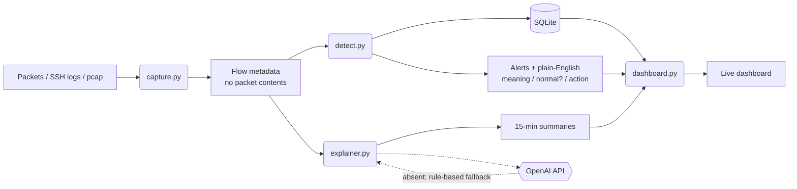

# brutedash — Project Orion

A mini SOC analyst for a home network: it watches traffic and SSH logs,
detects suspicious behavior, and explains it in plain English — written so
a non-technical reader can understand every alert, and engineered so a
technical reviewer can verify every claim.

**Stack:** Python · Flask · SQLite (WAL) · scapy · vanilla JS (canvas) ·
OpenAI API (optional, every AI feature has a rule-based fallback)



## Project phases — what was added when

- **Phase 1 — SSH log triage (the original brutedash).** Parses SSH auth
  logs into SQLite and writes per-IP technical briefs through a Flask app.
  Added along the way: structured JSON briefs with schema validation, an
  IP-intel enricher (24h cache) so briefs name the attacker, and brief
  quality evals (3/3 passing). The LLM writes the brief when
  `OPENAI_API_KEY` is set; otherwise a rule-based template does.
- **Phase 2 — netmon, the live network monitor.** Watches this machine's
  interface, rolls packets into flow metadata (never packet contents),
  and serves a dashboard written for non-technical readers: plain-English
  alerts (what happened / is it normal / what to do), a 15-minute
  plain-English summary, and a live "right now" readout. Detection rules:
  port scans, unusual outbound ports, traffic spikes, beaconing. A
  watchdog pings the gateway and logs every outage. Also analyzes pcap
  files uploaded on the `/pcap` page.
- **Phase 3 — depth (shipped 2026-09-30).** The monitor learns the network
  over time: email alerts on High/Critical, dashboard password login,
  alert triage (Ack / Dismiss / AI verdict), weekly plain-English
  reports, run-as-a-service setup with a `/api/health` endpoint,
  first-seen baselining (flags an address suddenly moving 10x its norm),
  DNS anomaly detection, new-device + ARP-spoof detection, and AI
  tie-ins (triage verdicts, "ask your network" Q&A).
- **Phase 3.5 batch 1 — operator comfort.** Friendly device names,
  allowlist tables with suppression in detection, quiet hours, an
  alert-fatigue circuit breaker, and scheduled digest emails — all with
  dashboard UI.
- **Phase 3.5 batch 2 — probation + live graph (2026-10-01).** New
  devices sit on a 24-hour probation watch (flags >500 MB/hr, 100+
  outside addresses, or unusual ports); the static packet card became a
  live MB-per-tick traffic graph; `/api/stats` ships cumulative totals;
  `--host` flag so other devices on the LAN can reach the dashboard.
- **Phase 4 — planned.** Raspberry Pi sensor by the router for
  whole-network visibility (one machine only sees its own traffic today).
- **Phase 5 — planned.** Cloud console: per-site sensors report summaries
  and alerts over TLS to a central multi-tenant dashboard; raw packets
  never leave the site.

## netmon — live network monitor (Phase 2)

Watches **this machine's** network interface, rolls packets into flow
metadata (who talked to who, on what port, how many bytes — **never packet
contents**), and answers three questions on a live dashboard:

- **What needs your eyes?** — alerts written for non-technical readers: every
  alert explains what it means, whether it's normal, and what to do
- **What's happening?** — a plain-English summary every 15 minutes (or on
  demand with the "Explain now" button): headline, what's happening, what
  stands out, suggested actions
- **What's normal?** — a live "right now" readout plus a port guide, so you
  learn what everyday traffic looks like

Detection rules: port scans, unusual outbound ports, traffic spikes, and
**beaconing** (steady clockwork check-ins with one outside address — how
malware "phones home"). A watchdog pings the gateway + internet hosts and
logs every outage with timestamps.

The explainer uses an LLM when `OPENAI_API_KEY` is set, otherwise a
narrative rule-based summary — output is JSON-schema validated before
display, same discipline as the brief writer.

It also **analyzes pcap files** (e.g. exported from Wireshark): upload one
on the `/pcap` page and it runs the same pipeline — flows, detection,
plain-English explanation.

### Run it

```bash
pip install -r requirements.txt

# Full monitor (live capture needs root for raw sockets):
sudo python -m netmon.run
# open http://127.0.0.1:5001

# Analyze a pcap and exit:
python -m netmon.run --pcap capture.pcap

# Dashboard only (no capture):
python -m netmon.run --dashboard-only
```

Optional, for AI-written summaries:

```bash
export OPENAI_API_KEY=<your key here>
```

If port 5001 is taken on your machine: `python -m netmon.run --port 8080`.

Windows notes: install [Npcap](https://npcap.com/) for live capture, run
PowerShell **as administrator**, and use the `py` launcher
(`py -m pip install -r requirements.txt`, `py -m netmon.run --port 8080`).

### netmon structure

| File | What it does |
|---|---|
| `netmon/run.py` | Entry point: wires up watchdog + capture + monitor threads + dashboard |
| `netmon/capture.py` | Packets → flow metadata (live sniff or pcap); inline SYN port-scan tracker |
| `netmon/detect.py` | Periodic rules: spikes, unusual ports, beaconing (with alert cooldowns); every alert carries plain-English meaning / is-this-normal / what-to-do |
| `netmon/watchdog.py` | Ping-based drop detection (Windows + Linux ping flags); logs outages with start/end/duration |
| `netmon/explainer.py` | Evidence builder + plain-English summaries (LLM or narrative rule-based, validated); shared port guide |
| `netmon/dashboard.py` | Flask live dashboard: `/`, `/api/stats`, `/explain`, `/pcap` — written for non-technical readers |
| `netmon/db.py` | SQLite storage: flows, alerts, outages, summaries (WAL mode); auto-migrates older DBs |
| `netmon/notify.py` | Email alerts on High/Critical: plain-English subject + body, one email per alert kind per hour, silent when email isn't configured |
| `netmon/weekly.py` | Weekly plain-English rollup of the last 7 days (`--weekly-report` prints it, emails it when SMTP is set, LLM-polishes it when a key is set) |
| `netmon/ai_assist.py` | Optional OpenAI tie-ins: per-alert triage verdicts, "ask your network" Q&A over the last 24h, weekly-report polishing (never writes SQL, never touches the DB) |

### Phase 3 — depth

The monitor grew a second layer: it now *learns your network over time*
and taps you on the shoulder when something matters. All in the same
plain-English style as Phase 2.

- **Email alerts on High/Critical.** Set the SMTP variables below and the
  monitor emails you when something important is spotted — at most one
  email per alert kind per hour, written the way the dashboard writes
  (what happened, what it means, what to do). No SMTP configured? Silence,
  not errors.
- **Dashboard password.** Set `NETMON_PASSWORD` and every page except the
  login and the health check requires a session login. (The `/api/health`
  endpoint stays open on purpose — that's what service monitors ping.)
- **Alert triage.** On the dashboard every alert now has **Ack**,
  **Dismiss**, and **AI verdict** buttons. Acknowledge means "I've seen
  this"; dismiss means "not worth my time"; either takes it out of your
  mental inbox. Your choice is stored on the alert (with an optional note)
  and survives restarts.
- **Weekly plain-English report.** Run `python -m netmon.run
  --weekly-report` to print (and, when email is configured, email) a warm
  rollup of the last 7 days: how much went through, where it went,
  anything worth a look, connection drops, and new devices. Quiet weeks
  get a quiet report, not an error.
- **Run as a service + health endpoint.** The monitor is meant to live on
  your machine permanently now: [docs/run-as-service.md](docs/run-as-service.md)
  walks through Windows Task Scheduler and Linux systemd setup. The
  `/api/health` endpoint reports whether the web part is up, when traffic
  was last seen, and whether the data is **stale** (nothing captured in
  5+ minutes); a stale dashboard shows a red banner telling you to check
  that netmon is still running.
- **First-seen baselining.** The monitor now remembers every outside
  address, domain, and device the first time it sees it (`first_seen`
  table). A known address that suddenly moves far more than its own 7-day
  average — 10x and 50 MB absolute in an hour — gets flagged, like a faucet
  suddenly running full blast.
- **DNS anomaly detection.** Outbound lookups are recorded now, and three
  shapes get flagged: one domain looked up 200+ times in 10 minutes,
  25+ weird subdomains under one parent (the classic shape of DNS
  tunneling — data sneaked out disguised as address lookups), and a
  never-before-seen domain suddenly getting 50+ lookups.
- **New-device + ARP-spoof detection.** Hardware addresses seen on the
  local network are tracked: a new face on the block gets a low-key
  heads-up, and ARP weirdness — one device introducing itself as 3+
  different addresses, or an address answering with a new hardware
  address — raises a High alert.
- **AI triage verdicts + ask your network.** With `OPENAI_API_KEY` set,
  every alert gets an **AI verdict** button (a second opinion: real
  concern, likely benign, or uncertain, in 2–3 plain sentences), and the
  **/ask** page answers free-text questions about the last 24 hours from
  the monitor's own data. The model never writes SQL and never touches the
  database — it only reads a fixed evidence summary. Without a key, both
  features quietly report they're unavailable.

Databases from earlier versions upgrade themselves on startup — new
tables and columns are added in place, nothing is deleted.

### Environment variables

All optional. Set the ones you want; everything else degrades gracefully.

| Variable | Default | Enables | What it does |
|---|---|---|---|
| `NETMON_SMTP_HOST` | — | Email alerts + weekly report | Your mail server's address (e.g. `smtp.gmail.com`). Without it, no email goes out. |
| `NETMON_SMTP_PORT` | `587` | Email alerts + weekly report | Mail server port; 587 is the usual one for STARTTLS. |
| `NETMON_SMTP_USER` | — | Email alerts + weekly report | Login name for the mail server. |
| `NETMON_SMTP_PASS` | — | Email alerts + weekly report | Login password (app password, if your provider needs one). |
| `NETMON_ALERT_TO` | — | Email alerts + weekly report | The email address alerts and the weekly report are sent **to**. |
| `NETMON_SMTP_FROM` | `NETMON_SMTP_USER` | Email alerts | The address emails appear to come **from**. Defaults to the login name. |
| `NETMON_PASSWORD` | — | Dashboard password gate | When set, the dashboard asks for this password before showing anything (the health endpoint stays open). |
| `NETMON_SECRET_KEY` | random each start | Session security | Signs the login session cookie. Set it to something stable so logins survive restarts; leave unset and everyone gets logged out on restart. |
| `OPENAI_API_KEY` | — | AI summaries, triage verdicts, ask-your-network, weekly-report polish | Turns on all OpenAI features. Without it everything falls back to the rule-based versions. |

Example:

```bash
export NETMON_PASSWORD=<your dashboard password here>
export NETMON_SMTP_HOST=smtp.gmail.com
export NETMON_SMTP_USER=you@example.com
export NETMON_SMTP_PASS=<app password here>
export NETMON_ALERT_TO=you@example.com
sudo -E python -m netmon.run --port 8080   # -E keeps the exports for sudo
```

### Honest scope note

On a switched home network, one machine only sees **its own** traffic.
Whole-home visibility (every device) is Phase 4: a Raspberry Pi sensor by
the router. Phases 2–3.5 monitor the machine the software runs on.

---

## brutedash — SSH log triage (original module)

## Pipeline

**parse → detect → persist → brief**

1. **Parse** — paste an SSH auth log into the dashboard form (or POST it to `/`). Malformed lines are skipped, not crashed on.
2. **Detect** — `detector.detect_brute_force()` counts `Failed password` events per source IP, flags IPs at or above the threshold (default: 3), and assigns severity (`Medium` ≤ 10 attempts, `High` > 10).
3. **Persist** — findings are saved to SQLite (`detections.db`); IPs seen in earlier scans are flagged as repeat attackers.
4. **Brief** — before writing, the analyst enriches the attacker IP with a threat-intel lookup (geolocation, hosting/proxy signals; cached 24h, best-effort — intel never blocks the brief). The per-IP "Generate brief" button then writes a technical brief as **structured JSON** (`severity`, `observed_pattern`, `recommended_actions`), validated against a schema before rendering. The LLM path uses JSON mode with a strict "do not invent facts" prompt; invalid shapes fall back to rule-based writing, so a malformed model response can never corrupt the page.

**Evals** — `eval_briefs.py` scores every brief on schema adherence, grounding (anti-hallucination heuristic: every claim traceable to the evidence), and completeness. Run it after any prompt or model change:

```bash
python eval_briefs.py
```

## Run it

```bash
pip install -r requirements.txt
python app.py
# open http://127.0.0.1:5000
```

Optional, for LLM-written briefs:

```bash
export OPENAI_API_KEY=...
```

Then open `/history` to see past scans.

## Project structure

| File | What it does |
|---|---|
| `app.py` | Flask dashboard: `/` parse & scan, `/history` past scans, `/brief` per-IP technical brief |
| `detector.py` | Log parsing + brute-force detection: parse → count → threshold → severity |
| `ipintel.py` | IP enrichment tool: geolocation + hosting/proxy lookup, 24h SQLite cache |
| `eval_briefs.py` | Brief quality evals: schema, grounding, completeness |
| `gen_log.py` | Generates `auth.log` test data (seeded, reproducible) |
| `auth.log` | Sample log, including a malformed line the parser skips |
